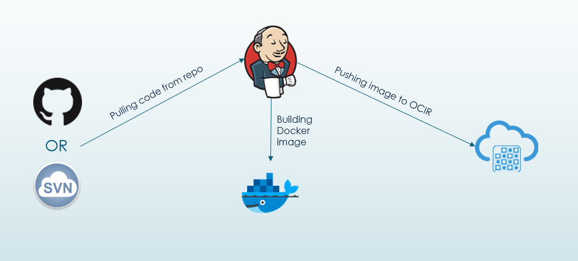
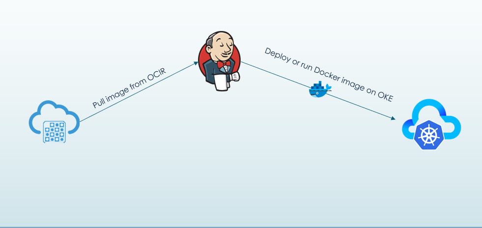

### Deploying Docker Image to kubernetes container(OKE) using Jenkins CI/CD
*First fork this repository [(Fork)](https://github.com/GuGu910/test)*

##### CI Pipeline:


1. Checkout GitHub code
2. Building the Docker Image
3. Push the image to Oracle Cloud Infra Registry(OCIR)

Jenkinsfile preview

```
pipeline{
	agent any
	stages{
		stage('Build docker image'){
			steps {
				script {
					def scmVars = checkout([
						$class: 'GitSCM',
						doGenerateSubmoduleConfigurations: false,
						userRemoteConfigs: [[
							url: ${GIT_URL}
						]],
						branches: [[name: '*/master']]
					])
					sh "sudo docker build -f Dockerfile -t app_flask:${scmVars.GIT_COMMIT} ./app_flask"
				}
			}
		}
```
Checkout from GitHub and building docker Image for the __`app_flask`__. In the place of __`${GIT_URL}`__ replace your forked git repository URL. Just mention which branch do you need to use in __`branches: `__.
```
		stage('Push image to OCIR') {
			steps {
				script {
					def scmVars = checkout([
						$class: 'GitSCM',
						doGenerateSubmoduleConfigurations: false,
						userRemoteConfigs: [[
							url: ${GIT_URL}
						]],
						branches: [ [name: '*/master'] ]
					])
					sh "sudo docker login -u ${params.REGISTRY_USERNAME} -p ${params.REGISTRY_TOKEN} ${REGION}.ocir.io"
					sh "sudo docker tag app_flask:${scmVars.GIT_COMMIT} ${params.REPO_PATH}/app_flask:${scmVars.GIT_COMMIT}"
					sh "sudo docker push ${params.REPO_PATH}/app_flask:${scmVars.GIT_COMMIT}"
					writeFile file: '/tmp/git_commit', text: "${scmVars.GIT_COMMIT}"
					writeFile file: '/tmp/repo', text: "${params.REPO_PATH}"
			}
		}
	}
}
```
Pushing the Docker image to OCIR and writing the __`${scmVars.GIT_COMMIT}`__ and __`${params.REPO_PATH}`__ into a diff files to access on deployment.
In the place of __`${REGION}`__ replace with OCI Region or else create environment variable in jenkins.

##### Creating Environment variables in Jenkins:
1. Follow __`Managin Jenkis -> Configure System -> Under Globel properties section`__.
2. Select the checkbox __`Environment varibales`__ and click on __`Add`__ button then add below details.

	  Name | Vaule
	  -----|------
	  `${REGION}` | (e.g) ***eu-frankfurt-1***

--------------------------------------------------------------------------------
Dockerfile

```
# Use an official Python runtime as a parent image
FROM python:2.7-slim

# Set the working directory to /app
WORKDIR /app

# Copy the current directory contents into the container at /app
COPY . /app

# Install any needed packages specified in requirements.txt
RUN pip install --trusted-host pypi.python.org -r requirements.txt

# Make port 5000 available to the world outside this container
EXPOSE 5000

# Define environment variable
ENV FLASK_APP app.py

# Run app.py when the container launches
CMD ["flask", "run", "--host=0.0.0.0"]
```
#### Creating CI Pipeline:
1. Click on the __`New Item`__ from the Jenkins dashboard.
2. Enter the item name as ***test_ci_pipe*** in the Text field and select the __`Pipeline`__ then Click on __`OK`__.
3. Add the below mentioned parameters in the __`General`__ tab.
	* Click the check box ***This project is parameterized*** and add the ***String Parameter*** from the dropdown __`Add parameter`__

    Parameter | Value
	  -----------|--------
	  `${REGISTRY_USERNAME}` | \<TENANCY_NAME\>/\<USERNAME>
	  `${REGISTRY_TOKEN}` | Auth token for the OCI User and the user should have the permission to manage OCIR. How to get token [here](https://www.oracle.com/webfolder/technetwork/tutorials/obe/oci/registry/index.html)
	  `${REPO_PATH}`| \<REGION\>.ocir.io/\<TENANCY_NAME\>
4. Click on the __`Pipeline`__ tab and select as below then save.

    Parameter| Value
	  ---------|------
	  Definition | Pipeline Script from SCM
	  SCM | Git (If private repo create Credentials)
	  Script Path | Jenkinsfile

#### CD Pipeline


1. Pull the image from OCIR
2. deploy the docker container to Kubernetes

CDPipe/deploy.sh
```
#!/bin/bash

# Creating the deployment app
sudo kubectl apply -f CDPipe/deployment.yaml

# Creating helloworld kubernet service
sudo kubectl apply -f CDPipe/service.yaml

# Creating Ingress for helloworld service
sudo kubectl apply -f CDPipe/ingress.yaml
```

CDPipe/Jenkinsfile
```
pipeline {
  agent any
  stages {
    stage('Deploying FLASK_APP') {
      steps {
        sh 'sudo bash deploy.sh'
      }

      }
    }
  }
}
```
CDPipe/deployment.yaml
```
apiVersion: apps/v1
kind: Deployment
metadata:
  name: appflask-deploy
spec:
  selector:
    matchLabels:
      app: appflask
  replicas: 1
  template:
    metadata:
      labels:
        app: appflask
    spec:
      containers:
      - name: appflask
        # enter the path to your image, be sure to include the correct region prefix
        # for pull the image from OCIR to Kubernetes cluster
        image: <REPO_PATH>/app_flask:<GIT_COMMIT>   # here app_flask is repository name
        ports:
        - containerPort: 5000
      imagePullSecrets:
      # enter the name of the secret you created
      - name: ocirsecret
```
In the place of __`<REPO_PATH>`__ and __`GIT_COMMIT`__ replace with respective __`${REPO_PATH}`__ and __`${GIT_COMMIT}`__.


CDPipe/service.yaml

```
apiVersion: v1
kind: Service
metadata:
  name: appflask-service
spec:
  type: LoadBalancer
  ports:
  - port: 5000
    protocol: TCP
    targetPort: 5000
  selector:
    app: appflask
```

#### Creating CD Pipeline:
1. Click on the __`New Item`__ from the Jenkins dashboard.
2. Enter the item name as ***test_cd_pipe*** in the Text field and select the __`Pipeline`__ then Click on __`OK`__.
3. Click on __`Build Triggers`__ tab and enter name of the ***test_ci_pipe*** in __`Projects to watch`__ by checking the __`Build after other projects are built`__.
4. Then check the box __`Trigger only if build is stable`__. (This option will Trigger the CD Pipeline when the CI Pipeline Succeed.)
5. Click on the __`Pipeline`__ tab and select as below then save.

    Parameter| Value
	  ---------|------
	  Definition | Pipeline Script from SCM
	  SCM | Git (If private repo create Credentials)
	  Script Path | CDPipe/Jenkinsfile

#### Finally build the pipeline `test_ci_pipe`.

## Some Referral Links:

Content | Link
--------|-----
Pushing Image to OCIR | https://www.oracle.com/webfolder/technetwork/tutorials/obe/oci/registry/index.html
Pulling Image from OCIR when Deploying on OKE |https://www.oracle.com/webfolder/technetwork/tutorials/obe/oci/oke-and-registry/index.html
